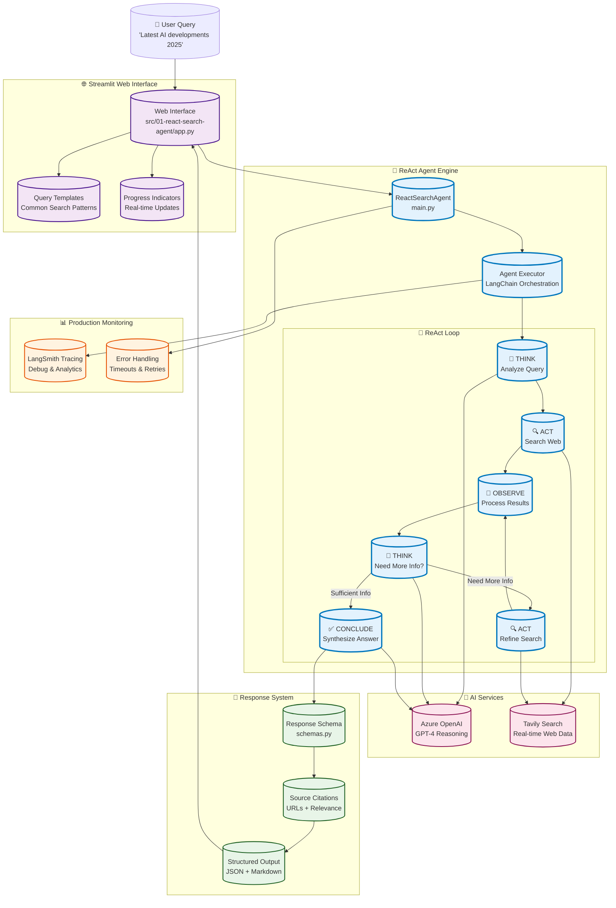

# VS 2026 Developer Productivity Samples 🚀

This repo showcases **.NET Aspire + Visual Studio 2026 Insiders features** to maximize developer productivity. The solution has been updated to target .NET 10 and includes a Scalar UI integration (replacing Swagger) for API exploration at /scalar/v1. Comprehensive .NET Aspire starter project and samples demonstrating Visual Studio 2026 Insiders features for building microservice-based cloud-native applications.

## 🚀 .NET Aspire Starter Project

A comprehensive .NET Aspire application demonstrating modern cloud-native development patterns with:

- **Orchestrated Services**: Multiple microservices managed by Aspire Host
- **API Gateway**: YARP reverse proxy for routing
- **Real-time Dashboard**: Blazor Server app for monitoring
- **Database Integration**: PostgreSQL with Entity Framework Core
- **Observability**: Built-in logging, metrics, and health checks
- **Service Discovery**: Automatic service registration and discovery

## 📁 Project Structure

```text
src/
├── Aspire.Host/              # 🎯 Orchestration and service management
├── Aspire.ServiceDefaults/   # ⚙️  Common service configurations
├── Aspire.Shared/            # 📦 Shared DTOs and models
├── Aspire.MinimalApi/        # 🔗 REST API with product endpoints
├── Aspire.BlazorApp/         # 📊 Interactive dashboard
└── Aspire.ApiGateway/        # 🌐 YARP reverse proxy
```

## 🛠️ Prerequisites

- [.NET 10.0 SDK](https://dotnet.microsoft.com/download/dotnet/10.0) (this repo has been updated to target net10.0)
- [Docker Desktop](https://www.docker.com/products/docker-desktop) (for PostgreSQL)
- [Visual Studio 2026 Insiders](https://visualstudio.microsoft.com/vs/preview/) or [Visual Studio Code](https://code.visualstudio.com/)
- **.NET Aspire workload**: `dotnet workload install aspire`

## 🚀 Getting Started

### 1. Clone the Repository

```bash
git clone https://github.com/vishipayyallore/vs2026-dev-productivity.git
cd vs2026-dev-productivity
```

## What this repo contains

- A complete Aspire-based starter app with multiple services (Minimal API, Blazor dashboard, API Gateway)
- Solution file: `VS2026DevProductivity.sln`
- Documentation: `API.md`, `SETUP.md`, and this `README.md`

## Tech stack

- .NET Aspire (solution updated to target .NET 10)
- YARP (API Gateway)
- Blazor (dashboard)
- EF Core + PostgreSQL
- OpenTelemetry + Serilog

## Prerequisites

- .NET 10 SDK
- Docker Desktop (for PostgreSQL)
- Entity Framework Core CLI tools
- Optional: Visual Studio 2026 Insiders or VS Code

## Quick start

1. Clone the repo

```bash
git clone https://github.com/vishipayyallore/vs2026-dev-productivity.git
cd vs2026-dev-productivity
```

2. Install/Update Entity Framework Core tools

```bash
dotnet tool update --global dotnet-ef
```

3. Start the database infrastructure

```bash
# Start PostgreSQL and pgAdmin using Docker Compose
.\infrastructure\datastore\dev-db.ps1 up -Detach
```

4. Setup the database schema

```bash
# Apply Entity Framework migrations to create the database schema
dotnet ef database update --project src/AspireApp.MinimalApi
```

5. Restore and build

```bash
dotnet restore
dotnet build VS2026DevProductivity.sln
```

6. Run the Aspire Host (which starts the other services)

```bash
cd src/Aspire.Host
dotnet run
```

Default service URLs (local):

- Aspire Dashboard: <https://localhost:15888>
- API Gateway: <https://localhost:5000>
- Minimal API: <https://localhost:5001>
- Blazor Dashboard: <https://localhost:5002>

Note: The Minimal API no longer exposes Swagger. Use the integrated Scalar UI for API exploration at: <https://localhost:5001/scalar/v1> (when Scalar is enabled in configuration).

## Development notes

- **Database Setup**: The application uses PostgreSQL with Entity Framework Core. Run migrations with `dotnet ef database update --project src/AspireApp.MinimalApi`
- **Infrastructure Management**: Use `.\infrastructure\datastore\dev-db.ps1` for database lifecycle management
- **Service Discovery**: All services communicate through Aspire's built-in service discovery
- **New services**: Should live in `src/` and reference `AspireApp.ServiceDefaults` for consistent configuration
- **Debugging**: Use the Aspire Host to run and debug multiple services simultaneously

## Database Management

```bash
# Start database stack
.\infrastructure\datastore\dev-db.ps1 up -Detach

# Stop database stack  
.\infrastructure\datastore\dev-db.ps1 down

# View database logs
.\infrastructure\datastore\dev-db.ps1 logs

# Clean database (removes all data!)
.\infrastructure\datastore\dev-db.ps1 clean
```

**Database Access:**
- **PostgreSQL**: `localhost:5432` (user: `postgres`, password: `example`, database: `productdb`)
- **pgAdmin**: <http://localhost:8080> (email: `admin@example.com`, password: `admin`)

For detailed database setup instructions, see [DATABASE-README.md](docs/DATABASE-README.md).


### **5-20 minutes: ReAct Search Agent** 🔥 **SHOWCASE**

**The Challenge**: Build an intelligent web search agent that can reason through complex queries

**Why This Matters**:

- **Real-world utility** - Everyone needs better search capabilities
- **ReAct Pattern** - Shows the reasoning + acting paradigm that powers all modern agents
- **Immediate value** - Works with any topic, any query, right now

#### **Technology Stack**

| Component                | Purpose                               | Our Implementation                           |
| ------------------------ | ------------------------------------- | -------------------------------------------- |
| **🤖 Agent**             | ReAct reasoning system                | `create_react_agent()` with Azure OpenAI    |
| **🔍 Web Search**        | Real-time information retrieval      | `TavilySearch()` with max_results=5          |
| **⚡ Agent Executor**     | Orchestrates reasoning & actions      | `AgentExecutor()` with tools & verbose mode |
| **🧠 LLM**               | Language model for reasoning          | Azure OpenAI GPT-4 deployment               |
| **📝 Prompt Template**   | Guides agent behavior                 | ReAct prompts with format instructions      |
| **📊 Response Schema**   | Structured output format              | Custom schemas with sources & confidence    |
| **🌐 Web Interface**     | Professional UI                       | Streamlit with query templates & progress   |
| **📈 Monitoring**        | Production observability             | LangSmith tracing for debugging & analytics |
| **🔧 Tool Integration**  | External service connections          | LangChain tool ecosystem                     |
| **⏱️ Error Handling**    | Production reliability               | Timeouts, retries, structured error responses |

#### **LangChain & LangSmith Components**

**🔗 LangChain Framework** - The foundation of our agent system:

| Component | Purpose | Our Implementation |
|-----------|---------|-------------------|
| **🤖 Agent** | Core reasoning system | `create_react_agent()` with GPT-4 |
| **🔧 Tools** | External capabilities | `TavilySearch()` for web search |
| **⚡ Executor** | Orchestrates agent + tools | `AgentExecutor()` manages ReAct loop |
| **📝 Prompts** | Guide agent behavior | ReAct prompts with format instructions |
| **🔗 Chains** | Sequence operations | Tool calling → Response formatting |
| **💾 Memory** | Conversation context | Built-in message history |
| **📊 Callbacks** | Monitor execution | LangSmith integration for tracing |

**📈 LangSmith Observability** - Production monitoring and debugging:

| Feature | Benefit | Demo Value |
|---------|---------|------------|
| **🔍 Trace Visualization** | See every step of reasoning | Watch Think → Act → Observe cycle |
| **⏱️ Performance Metrics** | Monitor response times | Track search latency and accuracy |
| **🐛 Error Tracking** | Debug failed searches | Handle API timeouts and retries |
| **📊 Analytics Dashboard** | Usage patterns and costs | Production deployment insights |
| **🔄 Feedback Loops** | Improve agent responses | Human feedback integration |

**🎯 Why This Tech Stack?**

- **🏢 Enterprise Ready**: Azure OpenAI + LangSmith = production-grade security and monitoring
- **🔄 Iterative Design**: ReAct pattern enables complex, multi-step reasoning
- **🛠️ Extensible**: LangChain's tool ecosystem supports any API or service
- **📈 Observable**: LangSmith provides the debugging and monitoring essential for production

#### **ReAct Search Agent Architecture**



**Key ReAct Components Demonstrated:**

- **🔄 Reasoning Loop**: Think → Act → Observe → Think cycle
- **🧠 LLM Integration**: Azure OpenAI for intelligent reasoning
- **🔍 Tool Integration**: Tavily for real-time web search
- **📊 Production Features**: Error handling, monitoring, structured responses

**Live Coding Demo**: `src/01-react-search-agent/` - **PRODUCTION-READY IMPLEMENTATION**

#### **Key Demonstrations** (15 minutes)

1. **ReAct Pattern in Action** (5 min) 🔥

   ```bash
   # Launch web interface for immediate impact
   python run_project.py search-web
   
   # Show reasoning process:
   # Query: "What are the latest developments in AI agents for 2025?"
   # Watch the agent: Think → Search → Think → Search → Conclude
   ```

2. **Web Search Integration** (4 min)

   ```python
   # Core agent setup
   from langchain_tavily import TavilySearch
   from langchain.agents.react.agent import create_react_agent
   
   tools = [TavilySearch(max_results=5)]
   agent = create_react_agent(llm, tools, react_prompt)
   
   # Demo: Live search with source verification
   ```

3. **Streamlit Interface** (3 min) ✅

   ```python
   # Professional web interface with:
   # - Query templates for common searches
   # - Real-time progress indicators  
   # - Source verification and citations
   # - Search history and analytics
   ```

4. **Production Patterns** (3 min)

   ```bash
   # Error handling, timeouts, retries
   # Structured responses with confidence scores
   # LangSmith tracing for debugging
   ```

**Demo Checkpoint**: Search for current tech news and show reasoning steps

## Contributing

1. Fork and create a branch
2. Make changes and open a PR

## License

MIT — see the `LICENSE` file.
