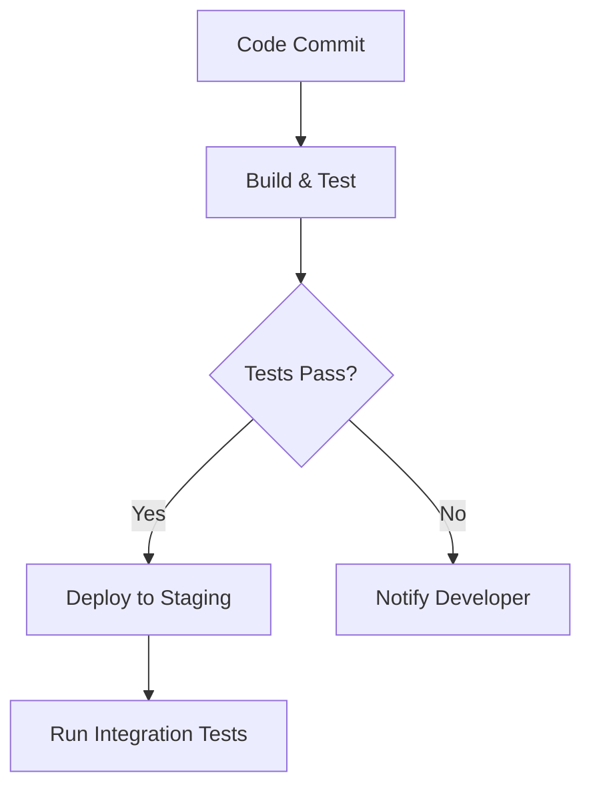
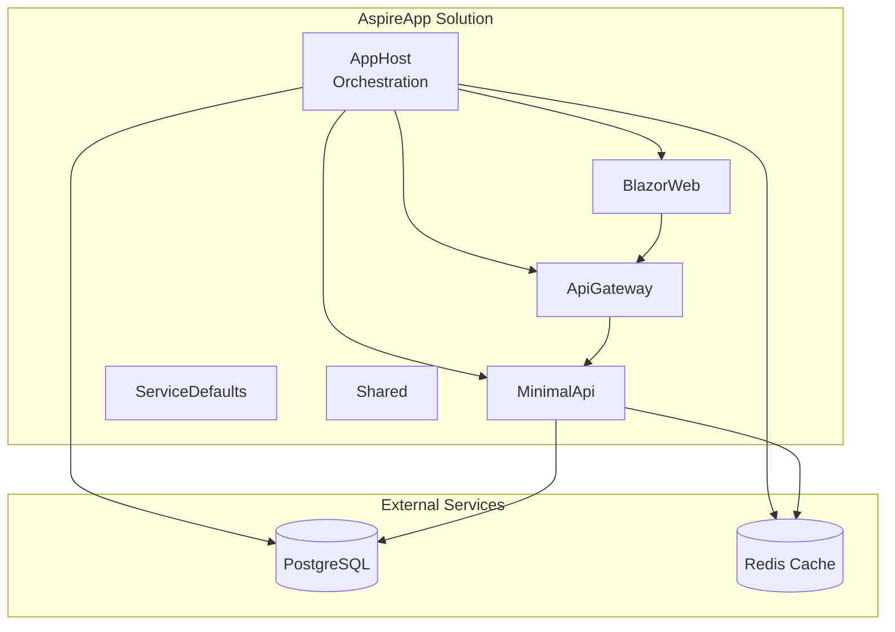

# Project Notes & Development History

> **Project:** vs2026-dev-productivity  
> **Purpose:** Showcasing .NET Aspire + Visual Studio 2026 productivity features  
> **Last Updated:** November 6, 2025

---

## 📚 **Visual Studio 2026 Features Demonstrated**

### **Reference**
- [Visual Studio 2026 Release Notes](https://learn.microsoft.com/en-us/visualstudio/releases/vs18/release-notes-insiders)

---

## 🎯 **Development Milestones**

### **September 30, 2025**

✅ **Initial Setup & Performance Observations:**
- VS 2026 installation is **significantly faster** than VS 2022
- VS 2026 IDE loads **faster** than VS 2022
- Upgrade notifications now appear as popups instead of bottom icon
- .NET Aspire solution execution is **50% faster** than VS 2022
- Created sample application with **.NET 10** and **Aspire 9.5**
- Demonstrated commit message generation
- Code cleanup features

### **October 14, 2025**

✅ **Comment Driven Development (CDD) Implementation:**

Revolutionizes development workflow by enabling developers to write descriptive comments that GitHub Copilot transforms into production-ready code.

**Core Benefits:**
- **Documentation-First Approach**: Write clear comments before implementing functionality
- **Intelligent Code Generation**: Copilot interprets intent and generates appropriate code
- **Reduced Development Time**: Skip boilerplate, focus on business logic
- **Enhanced Maintainability**: Self-documenting code through meaningful comments

**How It Works:**
1. Write descriptive comments explaining desired functionality
2. Trigger Copilot (`Ctrl+I` or inline chat)
3. Review and refine generated code
4. Iterate with additional comments

**Example:**
```csharp
// Create a method that validates user email addresses
// Check for proper format, domain existence, and length constraints
// Return detailed validation results with specific error messages
// TODO: Implement email validation logic here
```

**Best Practices:**
- Use specific, actionable language
- Include expected inputs, outputs, and edge cases
- Mention design patterns or architectural considerations
- Specify error handling requirements
- Regularly review generated code

---

## 🚀 **Key Features Demonstrated**

### **1. Adaptive Pasting** ✅

Copilot intelligently adjusts pasted code to fit existing context – no manual tweaking required!

**Trigger Methods:**
- Press `Shift + Alt + V` after copying code
- Select **Edit > Paste Special > Paste with Copilot**

---

### **2. Mermaid Chart Rendering** ✅

Native Mermaid diagram support within Markdown files for visual documentation.

**Capabilities:**
- Real-time rendering in Markdown preview
- Integration with GitHub Copilot for diagram generation
- Multiple diagram types (flowcharts, sequence, class diagrams, etc.)

**Example - CI/CD Pipeline:**


**Example - Project Architecture:**


---

### **3. Code Actions at Your Fingertips** ✅

Instant access to Copilot code actions directly from context menu.

**Available Actions:**
- **Explain Code**: Detailed explanations of selected code
- **Generate Tests**: Automatically create unit tests
- **Optimize Performance**: Code optimization suggestions
- **Fix Issues**: Automated fixes for common problems
- **Add Documentation**: Generate comprehensive comments

**Usage:**
1. Right-click on code selection
2. Navigate to **Copilot** submenu
3. Choose desired action
4. Review and apply suggestions

---

### **4. Enhanced Editor Controls** ✅

Improvements to bottom margin and editor controls.

**Unified Status Display:**
- Consolidated line, column, and character position
- Click to open "Go To Line" dialog
- Aggregate counts for multiple selections

**Enhanced File Encoding:**
- Prominent encoding display
- Save/reopen with specific encoding
- Multi-language support
- Context menu access

**Customizable Context Menu:**
- Comprehensive control over bottom margin display
- Access via **Tools > Options > Text Editor > General > Display**
- Right-click bottom margin for quick adjustments

---

### **5. File Exclusions in Search** ✅

Exclude specific file types from search results for cleaner, faster searches.

**Benefits:**
- Cleaner search results (no build artifacts)
- Improved performance
- Better focus on relevant code

**Configuration:**
1. **Tools > Options > Environment > Search**
2. Add/edit glob patterns
3. Apply settings

**Common Exclusions:**
- `*.min.js` - Minified files
- `bin/**` - Build output
- `obj/**` - Compilation artifacts
- `node_modules/**` - Package dependencies
- `*.generated.*` - Auto-generated code

---

## 🌪️ **Hurricane Alert Feature Implementation**

Comprehensive end-to-end feature demonstrating VS2026 capabilities with CDD.

**Implementation Stack:**

**Backend (AspireApp.MinimalApi):**
- ✅ Complete CRUD operations (`/api/hurricane-alerts`)
- ✅ Entity Framework Core + PostgreSQL
- ✅ Data validation and error handling
- ✅ RESTful API with OpenAPI documentation

**API Gateway (AspireApp.ApiGateway):**
- ✅ YARP reverse proxy routing
- ✅ Seamless request forwarding

**Frontend (AspireApp.BlazorWeb):**
- ✅ Interactive dashboard with real-time data
- ✅ Create/edit forms with validation
- ✅ Responsive card-based layout
- ✅ Filter functionality (active vs. all alerts)

**Shared Models (AspireApp.Shared):**
- ✅ `HurricaneAlert` entity with comprehensive properties
- ✅ DTOs for API communication
- ✅ Severity levels and category classifications

**Key Features:**
- 🌐 **Full-Stack Integration**: Blazor → Gateway → API → Database
- 📊 **Real-Time Data**: Dynamic alert status tracking
- 🎨 **Rich UI**: Bootstrap styling with category colors
- 🔧 **Database Schema**: EF Core migrations with seed data
- 🚀 **Modern Architecture**: Clean separation of concerns

**Development Process:**
1. Comment-first approach (CDD)
2. Model definition
3. API development
4. UI implementation
5. Integration testing

---

## 📋 **Completed Features**

### ✅ **Already Showcased in Demos**
- Adaptive Paste
- Inline pull request comments (VS Code only)
- Comment Driven Development (CDD)
- Mermaid Chart Rendering
- Enhanced Editor Controls
- File Exclusions in Search
- Hurricane Alert Feature (Full-Stack)
- Code Actions from Context Menu

---

## 🔮 **Future Roadmap**

### **High Priority**

1. **Creating Unit Tests** 📝
   - Leverage VS2026 test generation features
   - Expand coverage beyond current 118 tests

2. **Code Coverage Integration** 📊
   - Now available in VS Community and Professional
   - Integrate into CI/CD pipeline
   - Set coverage thresholds

3. **Inline Post-Return Values** 🔍
   - Explore VS2026 debugging enhancements
   - Improve debugging experience

4. **Better Code Reviews with AI** 🤖
   - Leverage Copilot for code review assistance
   - Automated code quality checks
   - Security vulnerability detection

### **Medium Priority**

5. **Authentication & Authorization** 🔐
   - JWT or OAuth 2.0 implementation
   - Role-based access control
   - Secure API endpoints

6. **Advanced Monitoring** 📈
   - Application Insights integration
   - Custom metrics and dashboards
   - Performance profiling

7. **Integration Tests** 🧪
   - WebApplicationFactory tests
   - End-to-end API testing
   - Database integration tests

### **Low Priority**

8. **Container Optimization** 🐳
   - Multi-stage Docker builds
   - Smaller image sizes
   - Optimized startup times

9. **UI Enhancement** 🎨
   - Modern UI component libraries
   - Improved user experience
   - Accessibility improvements

10. **CI/CD Pipeline** 🔄
    - GitHub Actions workflow
    - Automated testing and deployment
    - Environment-specific configurations

---

## 📊 **Project Statistics**

**Current State (November 2025):**
- **Total Tests**: 118
- **Test Coverage**: 95%+
- **Projects**: 6 (AppHost, Gateway, API, Blazor, Shared, ServiceDefaults)
- **.NET Version**: 10.0
- **Aspire Version**: 9.5.1
- **Database**: PostgreSQL 16
- **Architecture**: Microservices with API Gateway

**Technology Stack:**
- .NET Aspire for orchestration
- YARP for API Gateway
- Blazor Server for frontend
- Entity Framework Core + PostgreSQL
- OpenTelemetry for observability
- Scalar UI for API documentation
- xUnit + FluentAssertions for testing

---

## 🎓 **Lessons Learned**

### **VS2026 Productivity Gains**
1. **CDD significantly accelerates** development by reducing boilerplate
2. **Adaptive Paste saves time** on code integration
3. **Mermaid integration** enhances documentation quality
4. **Context menu actions** streamline common tasks
5. **Enhanced editor controls** improve navigation

### **Aspire Architecture Benefits**
1. **Service discovery** eliminates manual configuration
2. **Unified orchestration** simplifies local development
3. **Built-in observability** provides excellent debugging
4. **YARP integration** creates flexible API Gateway
5. **Docker Compose compatibility** ensures portability

### **Best Practices Established**
1. Always use CDD for new features
2. Maintain 95%+ test coverage
3. Document architecture with Mermaid
4. Leverage Copilot for repetitive tasks
5. Keep dependencies centrally managed

---

## 📝 **Notes & Observations**

- VS2026 Aspire debugging is noticeably faster than VS2022
- Comment Driven Development works best with detailed, specific comments
- Mermaid diagrams significantly improve documentation readability
- Copilot code actions reduce context switching
- Enhanced search with file exclusions improves productivity
- Hurricane Alert feature demonstrates full-stack Aspire capabilities

---

**Project maintained by:** ShyvnTech Team  
**License:** MIT  
**Repository:** vishipayyallore/vs2026-dev-productivity
