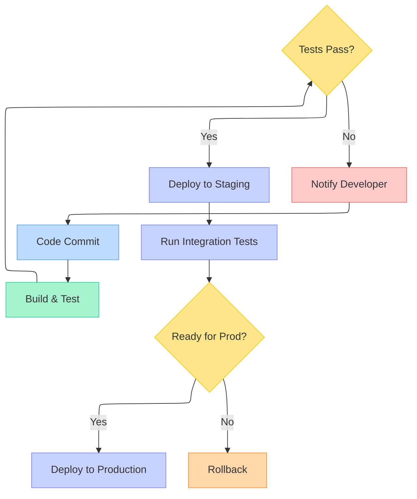

# Visual Studio 2026 Developer Productivity Enhancements

## 30 September 2025

> 1. VS 2026 Installation is much faster than VS 2022
> 1. VS 2026 IDE loads faster than VS 2022
> 1. Upgrades popup instead of showing the notification icon at the bottom.
> 1. Executing a .net aspire solution is much (at least 50%) faster than VS 2022.
> 1. Create a sample application with .NET 10, and Aspire 9.5
> 1. Creating Commit Messages
> 1. Code Clean Up

## 14 October 2025

### Adaptive Pasting

> Let Copilot intelligently adjust your pasted code to seamlessly fit the context of your existing code – no more manual tweaking required!

```text
You can trigger Adaptive Paste by:

- Pressing **Shift + Alt + V** after copying your code to see the suggestion immediately.
- Selecting **Edit > Paste Special > Paste with Copilot** from the menu.
```

### Mermaid Chart Rendering

Visual Studio 2026 introduces native Mermaid diagram support within Markdown files. This enhancement allows developers to create visual representations of system architectures, workflows, and data flows directly in documentation.

Key capabilities include:

- Real-time rendering in the Markdown preview pane
- Integration with GitHub Copilot for diagram generation
- Support for multiple diagram types (flowcharts, sequence diagrams, class diagrams, etc.)

Example workflow diagram for a CI/CD pipeline:



To use this feature, simply write Mermaid syntax in code blocks and view the rendered output through the preview panel. Copilot can assist by generating diagram syntax based on your descriptions.

### Code Coverage

Code coverage is now available in Visual Studio Community and Professional editions for the first time – ensuring your code is well-tested has never been easier! (Yet to explore)
