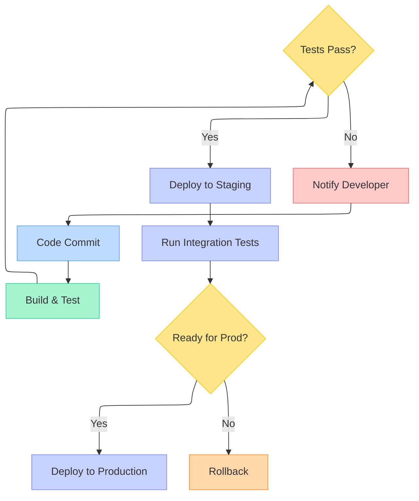

# Visual Studio 2026 Developer Productivity Enhancements

## 30 September 2025

> 1. VS 2026 Installation is much faster than VS 2022
> 1. VS 2026 IDE loads faster than VS 2022
> 1. Upgrades popup instead of showing the notification icon at the bottom.
> 1. Executing a .net aspire solution is much (at least 50%) faster than VS 2022.
> 1. Create a sample application with .NET 10, and Aspire 9.5
> 1. Creating Commit Messages
> 1. Code Clean Up

## 14 October 2025

### Comment Driven Development (CDD)

Visual Studio 2026 revolutionizes the development workflow with Comment Driven Development (CDD), enabling developers to write descriptive comments that GitHub Copilot transforms into production-ready code. This approach promotes better documentation while accelerating development cycles.

**Core Benefits:**

- **Documentation-First Approach**: Write clear, descriptive comments before implementing functionality
- **Intelligent Code Generation**: Copilot interprets comment intent and generates appropriate code
- **Reduced Development Time**: Skip boilerplate coding and focus on business logic
- **Enhanced Code Maintainability**: Self-documenting code through meaningful comments

**How It Works:**

1. **Write Descriptive Comments**: Start with detailed comments explaining what you want to accomplish
2. **Trigger Copilot**: Use `Ctrl+I` or the Copilot inline chat to generate code from comments
3. **Review and Refine**: Evaluate generated code and provide additional context if needed
4. **Iterate**: Add more comments and let Copilot build upon existing implementations

**Example Workflow:**

```csharp
// Create a method that validates user email addresses
// Check for proper format, domain existence, and length constraints
// Return detailed validation results with specific error messages
// TODO: Implement email validation logic here
```

After writing this comment, Copilot can generate a comprehensive email validation method with proper error handling, format checking, and domain validation logic.

**Best Practices:**

- Use specific, actionable language in comments
- Include expected inputs, outputs, and edge cases
- Mention relevant design patterns or architectural considerations
- Specify error handling requirements and validation rules
- Regularly review and refine generated code for accuracy and performance

### Adaptive Pasting

> Let Copilot intelligently adjust your pasted code to seamlessly fit the context of your existing code – no more manual tweaking required!

```text
You can trigger Adaptive Paste by:

- Pressing **Shift + Alt + V** after copying your code to see the suggestion immediately.
- Selecting **Edit > Paste Special > Paste with Copilot** from the menu.
```

### Mermaid Chart Rendering

Visual Studio 2026 introduces native Mermaid diagram support within Markdown files. This enhancement allows developers to create visual representations of system architectures, workflows, and data flows directly in documentation.

Key capabilities include:

- Real-time rendering in the Markdown preview pane
- Integration with GitHub Copilot for diagram generation
- Support for multiple diagram types (flowcharts, sequence diagrams, class diagrams, etc.)

Example workflow diagram for a CI/CD pipeline:



To use this feature, simply write Mermaid syntax in code blocks and view the rendered output through the preview panel. Copilot can assist by generating diagram syntax based on your descriptions.

### Code Actions at Your Fingertips

Visual Studio 2026 enhances developer workflow by providing instant access to Copilot code actions directly from the context menu. This streamlined approach eliminates the need for manual prompt typing and accelerates common development tasks.

**Available Actions:**

- **Explain Code**: Get detailed explanations of selected code segments
- **Generate Tests**: Automatically create unit tests for functions and classes
- **Optimize Performance**: Receive suggestions for code optimization
- **Fix Issues**: Apply automated fixes for common coding problems
- **Add Documentation**: Generate comprehensive code comments and documentation

**How to Use:**

1. Right-click on any code selection in the editor
2. Navigate to the **Copilot** submenu in the context menu
3. Choose from the five available actions based on your current needs
4. Review and apply the generated suggestions

This feature significantly reduces development time by providing contextual assistance without interrupting your coding flow.

### Enhanced Editor Controls

Visual Studio 2026 introduces significant improvements to editor controls, particularly focusing on the bottom margin area that developers interact with frequently during coding sessions.

**Unified Status Display:**
The bottom margin now consolidates line, column, and character position into a single, comprehensive display. Clicking this unified display opens the "Go To Line" dialog for rapid navigation. When working with multiple selections, you'll see aggregate counts for selections, characters, and lines, with detailed information available by hovering over the selection margin.

**Enhanced File Encoding Management:**
File encoding information is now prominently displayed in the margin for quick reference. This feature supports:

- Quick encoding identification for better file compatibility
- Save/reopen functionality with specific encoding options
- Multi-language support with consistent readability across systems
- Context menu access for encoding selection with dropdown options

**Customizable Context Menu:**
A new context menu provides comprehensive control over bottom margin information display. This menu encompasses all editor margins, from zoom controls to the new encoding margin, allowing developers to customize their workspace according to their preferences.

**Configuration Options:**
Access these settings through **Tools > Options > Text Editor > General > Display > Show editing context in the editor**. For immediate adjustments, right-click the bottom margin to open the context menu and modify displayed information without disrupting your workflow.

### File Exclusions in Search

Visual Studio 2026 enhances search functionality by allowing developers to exclude specific file types from search results, reducing clutter and improving focus on relevant code files.

**Key Benefits:**

- **Cleaner Search Results**: Eliminate build artifacts, minified scripts, and generated files from search output
- **Improved Performance**: Faster search execution by skipping unnecessary files
- **Better Focus**: Concentrate on source code and relevant documentation only

**Configuration Process:**

1. Navigate to **Tools > Options > Environment > Search**
2. Locate the **Exclude files from search results** section
3. Add, edit, or remove glob patterns to control file exclusions
4. Apply settings to customize your search experience

**Search Behavior:**

- **Quick Find**: Exclusions are automatically applied to streamline results
- **Find in Files**: Exclusions work in addition to existing file type selections
- **Toggle Control**: Use the toggle button next to file types to easily enable/disable exclusions

**Common Exclusion Patterns:**

- `*.min.js` - Minified JavaScript files
- `bin/**` - Build output directories
- `obj/**` - Compilation artifacts
- `node_modules/**` - Package dependencies
- `*.generated.*` - Auto-generated code files

This feature significantly improves developer productivity by ensuring search operations focus on the files that matter most to your development workflow.

## Next Demo

### Code Coverage

Code coverage is now available in Visual Studio Community and Professional editions for the first time – ensuring your code is well-tested has never been easier! (Yet to explore)
