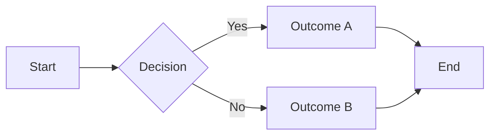

# Visual Studio 2026 Developer Productivity Enhancements

## 30 September 2025

> 1. VS 2026 Installation is much faster than VS 2022
> 1. VS 2026 IDE loads faster than VS 2022
> 1. Upgrades popup instead of showing the notification icon at the bottom.
> 1. Executing a .net aspire solution is much (at least 50%) faster than VS 2022.
> 1. Create a sample application with .NET 10, and Aspire 9.5
> 1. Creating Commit Messages
> 1. Code Clean Up

## 14 October 2025

### Adaptive Pasting

> Let Copilot intelligently adjust your pasted code to seamlessly fit the context of your existing code – no more manual tweaking required!

```text
You can trigger Adaptive Paste by:

- Pressing **Shift + Alt + V** after copying your code to see the suggestion immediately.
- Selecting **Edit > Paste Special > Paste with Copilot** from the menu.
```

### Mermaid Chart Rendering

We are excited to announce that Visual Studio now supports rendering Mermaid charts in the Markdown editor, where you can provide your own Mermaid syntax or have Copilot generate it for you! This new feature lets you visualize complex data structures and workflows directly within your code editor.

For example, you can write a flowchart in your Markdown file:



When you click the **Preview** button (top-left of the editor), your Mermaid chart will be rendered in the preview pane, allowing you to see the visual representation of your data.

You can also ask Copilot Chat to generate diagrams for you. Just describe what you need, and Copilot will provide the appropriate Mermaid syntax, which you can then preview immediately.

Please give it a try and share your feedback or suggestions to help us improve this feature!

### Code Coverage

Code coverage is now available in Visual Studio Community and Professional editions for the first time – ensuring your code is well-tested has never been easier! (Yet to explore)
